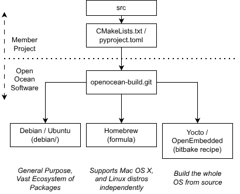

# openocean-build

This repository contains build metadata for our [member projects](https://oceansoft.org/member-projects/).

Member projects are responsible for maintaining source code using git, a working build and install (CMake for C/C++, pyproject.toml for Python, etc.), and a tagged release schedule. From there, Open Ocean Software handles the secure build pipeline and package repository.

We are working to support multiple distribution ecosystems, based on a tiered approach (Tier 1 is highest priority).

## Tier 1

- Debian and Ubuntu (*.deb): These Linux distributions are widely used in the marine robotics community, and have a vast collection of existing packages.

## Tier 2

- OpenEmbedded (Yocto): used by many embedded developers to create bespoke filesystems from source.
- Homebrew: supports MacOS X and can be used on many Linux distros as well (independent of the system package manager).
